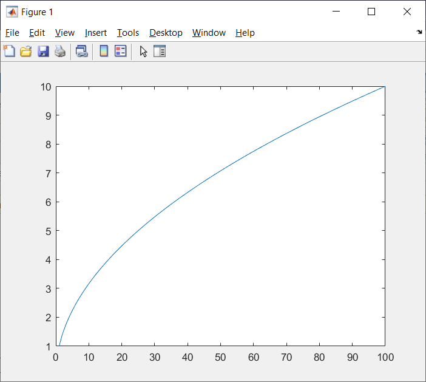
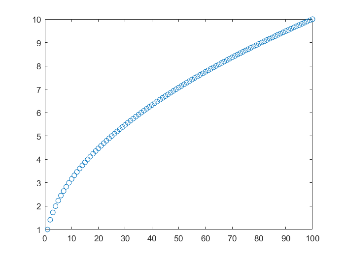

MATLAB is pretty great for visualizing your results. The main function for visualization is `plot`; it's an incredibly powerful function with many options. In our tutorial, I will show you just the basic use; if you are curious, you can read more about it on the excellent [MATLAB website](https://www.mathworks.com/help/matlab/ref/plot.html). 

To see a simple example of how it works, let's plot the square root function. Let's create a vector `x` of numbers from 1 to 100, and another vector `y` of their square roots, and then plot `y` against `x`:

~~~
x = 1:100;
y = sqrt (x);
plot (x, y);
~~~
{: .matlab}

A new window will pop up with a beautiful plot of a square root function:

If you want, you can save it as a picture (JPEG, TIGG, PNG, etc.) by clicking `File` -> `Save as`. If you are familiar with vector graphics software like Corel Draw or Adobe Illustrator, you can save it as extended postscript (EPS) and then edit it in Corel Draw or Illustrator; with practice, you can create very high-quality graphics.

The plot that we created is called a *line plot*, where the data points are conneted with lines. Sometimes we want to create a scatter plot, where each data point is shown with a marker. Let's do it:

~~~
plot (x, y, 'o')
~~~
{: .matlab}

We will see that our line plot will be replaced with a scatter plot:

Here, each of the 100 datapoints is represented with a circle. You can also use other markers (dots, crosses, triangles, etc.); refer to the `plot` manual on the MATLAB website. 

Notice that our old line plot was replaced with a scatter plot. If you want to plot the scatter plot on a different figure, use the `figure` command before `plot`. On the other hand, if you want the scatter plot to be plotted on top of the line plot, use the `hold on` command; this way, all plots within one figure will be overlaying on top of each other.

So far, we have used the command-line interface to MATLAB. Oftentimes, you need to write a program and save it so you can rerun it later. A MATLAB program is called a *script*, and it is a file with the `.m` extension. 

I have prepared an example for you. If you are using Palmetto to run MATLAB, type this in terminal (not in MATLAB window):

~~~
git clone https://github.com/clemsonciti/matlab_workshop_examples.git
~~~
{: .bash}

This should create a folder called matlab_workshop_examples with a couple of examples. Let's look at the script called `blood_pressure.m`.

The first line, `clear all`, lears all previous variables from the workspace. It's good practice to have `clear all` at the beginning of your script (unless your script specifically relies on other scripts to create some variables in the workspace). 

The second line loads the Excel spreadsheet called `matlab_workshop_dataset.xls`. In MATLAB, reading the Excel spreadsheets is very easy, which is quite handy if you store your data in Excel. Writing into an Excel spreadsheet could be tricky, however (it works fine on Windows but is buggy on Mac OS). Here, we load the numerical values from the spreadsheet and save them into a matrix called `num`: `num = xlsread ('matlab_workshop_dataset.xls');`. There is a lot more to the `xlsread` function; please read `help xlsread` if you plan to work with Excel spreadsheets.

The spredsheet contains (fake) medical data for ten people: their patient IDs, systolic and diastolic pressure, pulse, and history of stroke (1 == had a stroke before, 0 == never had a stroke). Our MATLAB script saves different columns of the `num` matrix as separate vectors (`id`, `sys`, `dias`, `pulse`, `cvd`; CVD stands for "cardiovascular disease", like stroke). Then, we 


