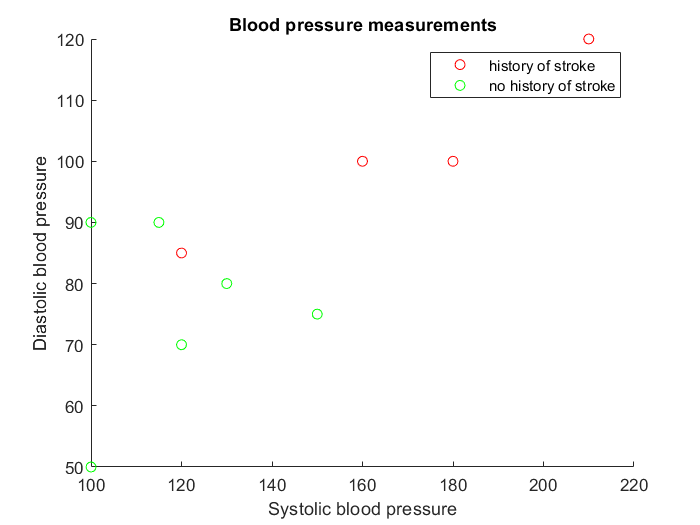

So far, we have used the command-line interface to MATLAB. Oftentimes, you need to write a program and save it so you can rerun it later. A MATLAB program is called a *script*, and it is a file with the `.m` extension. 

I have prepared an example for you. If you are using Palmetto to run MATLAB, type this in terminal (not in MATLAB window):

~~~
git clone https://github.com/clemsonciti/matlab_workshop_examples.git
~~~
{: .bash}

This should create a folder called matlab_workshop_examples with a couple of examples. Let's look at the script called `blood_pressure.m`. 

The first line, `clear all`, lears all previous variables from the workspace. It's good practice to have `clear all` at the beginning of your script (unless your script specifically relies on other scripts to create some variables in the workspace). 

The second line loads the Excel spreadsheet called `matlab_workshop_dataset.xls`. In MATLAB, reading the Excel spreadsheets is very easy, which is quite handy if you store your data in Excel. Writing into an Excel spreadsheet could be tricky, however (it works fine on Windows but is buggy on Mac OS). Here, we load the numerical values from the spreadsheet and save them into a matrix called `num`: `num = xlsread ('matlab_workshop_dataset.xls');`. There is a lot more to the `xlsread` function; please read `help xlsread` if you plan to work with Excel spreadsheets.

The spredsheet contains (fake) medical data for ten people: their patient IDs, systolic and diastolic pressure, pulse, and history of stroke (1 == had a stroke before, 0 == never had a stroke). Our MATLAB script saves different columns of the `num` matrix as separate vectors (`id`, `sys`, `dias`, `pulse`, `cvd`; CVD stands for "cardiovascular disease", like stroke). Then, we find the indices of patients who had a stroke, and of patients who did not have a stroke. Then, we create a new figure, and draw a scatterplot of systolic versus diastolic blood pressure for our patients.

To run this script, click the `Run` button. You should see a new window with the scatter plot:

The script has some useful plotting tools:
- the patients with and without a history of stroke are plotted with markers of different colours;
- the axes are labeled, using `xlabel` and `ylabel` functions;
- the `title` function specifies the title of the figure;
- finally, `legend` creates a legend.

Finally, let's do some very basic statistics. Let's compute the mean systlic nd siastolic blood pressure for people who had a stroke:

~~~
mean (sys (cvd_yes))
~~~
{: .matlab}

~~~
ans =

  167.5000
~~~
{: .output}

~~~
mean (dias (cvd_yes))
~~~
{: .matlab}

~~~
ans =

  101.2500
~~~
{: .output}

And, let's compute these values for people who did not have a stroke:

~~~
mean (sys (cvd_no))
~~~
{: .matlab}

~~~
ans =

   119.1667
~~~
{: .output}

~~~
mean (dias (cvd_no))
~~~
{: .matlab}

~~~
ans =

  75.8333
~~~
{: .output}

You can see that both measures of blood pressure are lower in people who did not have a stroke. So, watch your blood pressure!

Let's compute the correlation between systoli and diastolic pressure:

~~~
corrcoef (sys, dias)
~~~
{: .matlab}

~~~
ans =
    1.0000    0.7558
    0.7558    1.0000
~~~
{: .output}

The `corrcoef` function computes the correlation matrix of Pearson's correlation coefficients. It's kind of a weird output format, but we see that the correlation between systolic and diastolic pressure is 0.7558. 

MATLAB is used a lot for data analysis, so it has many, many more statistical functions (t tests, F tests, ANOVA, nonparametric stats, multivariate tests, all the way up to machine learning). I hope today's introduction was enough to get your foot in the door and to generate some interest in MATLAB. It comes with excellent documentation, and there is a very active online community of MATLAB users, as well as plenty of examples and tutorials.


